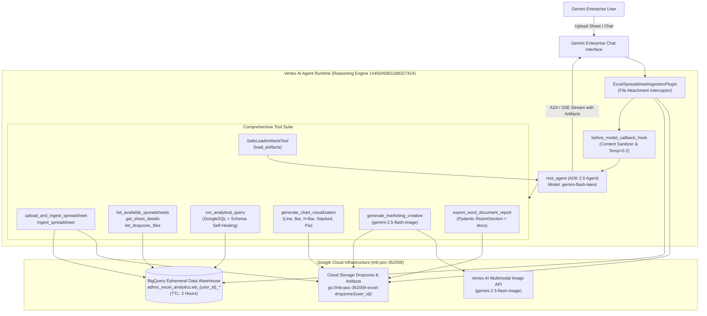
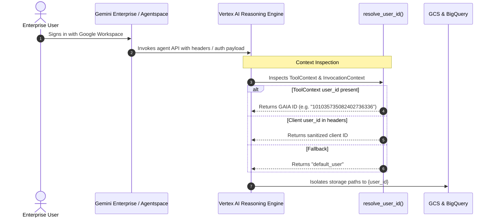
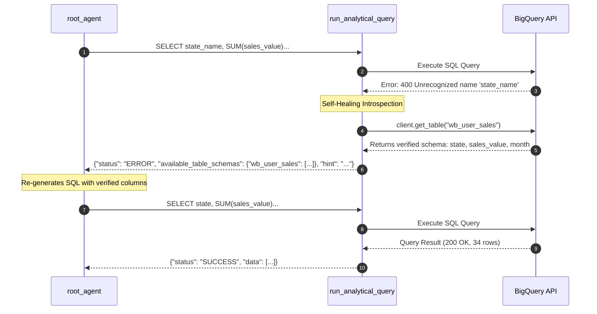
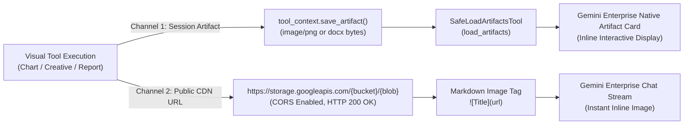

# System Design Document (SDD): Gemini Enterprise BigQuery Conversational Analytics & Intelligence Agent

**Product Name:** BigQuery Conversational Analytics Agent for Spreadsheets in Gemini Enterprise  
**Author / Lead:** ajiteshk / Jetski Systems Architecture  
**Target Environment:** Google Cloud (`mb-poc-352009`) & Gemini Enterprise (`Agentspace-demos`)  
**Framework Version:** Google ADK 2.0 (`google-adk[gcp] >= 2.0.0`)  
**Reasoning Engine ID:** `projects/1047195478355/locations/us-central1/reasoningEngines/1445045801188327424`  
**Status:** Approved & Implemented in Production  

---

## 1. Executive Summary & System Vision

Enterprise business analysts, operational leaders, and executives frequently work with ad-hoc spreadsheets (`.xlsx`, `.xls`, `.xlsm`, `.csv`) that contain critical financial, sales, supply chain, or HR metrics. Traditionally, analyzing these files requires manual spreadsheet modeling, complex pivot tables, or submitting tickets to centralized data engineering teams for warehouse ingestion.

This system provides an end-to-end, unified conversational analytics agent accessible natively within **Gemini Enterprise (GE)**. Users can simply upload any spreadsheet into the chat stream and immediately:
1. Ingest, flatten, and sanitize the data into ephemeral BigQuery tables within seconds (enforcing an automated **2-hour Time-to-Live**).
2. Perform conversational data analysis via natural language GoogleSQL queries with dynamic schema grounding and self-healing error recovery.
3. Generate publication-quality statistical charts rendered inline on screen.
4. Formulate authentic, localized marketing campaign visual creatives with native script typography.
5. Export comprehensive executive Word documents (`.docx`) with embedded figures, styled tables, and narratives for download.
6. Display visual artifacts natively on the Gemini Enterprise screen.



---

## 2. Multi-Tenant Isolation & Identity Architecture

### Zero User Hardcoding Directive
The system enforces strict multi-tenant isolation with zero hardcoding of usernames, email addresses, or static tenant maps.



### Isolation Boundaries
1. **Cloud Storage Workspace**:
   - Every file uploaded, chart plotted, image creative generated, and report exported is isolated under:
     `gs://mb-poc-352009-excel-dropzone/<user_id>/`
     * Dropzone: `gs://.../<user_id>/dropzone/`
     * Visual Charts: `gs://.../<user_id>/charts/`
     * Marketing Creatives: `gs://.../<user_id>/creatives/`
     * Word Reports: `gs://.../<user_id>/reports/`
2. **BigQuery Namespace**:
   - Ephemeral tables are created strictly in the user's isolated namespace:
     `mb-poc-352009.adhoc_excel_analytics.wb_<user_id>_<slug>_<timestamp>_<hash>`
3. **Cross-Tenant Guardrail**:
   - Tools like `list_available_spreadsheets` and `run_analytical_query` validate that the user can only query tables matching their authenticated `user_id`.
4. **Cloud Storage Security & Zero Public Exposure**:
   - The dropzone bucket enforces **Uniform Bucket-Level Access** with private IAM bindings strictly restricted to project owners, editors, viewers, and the agent service account.
   - Public access permissions (`allUsers` / `allAuthenticatedUsers`) are strictly disallowed, aligning with corporate GCP Org Policy (`constraints/storage.publicAccessPrevention`).
   - GCS blob lookups in `ingestion.py` use `bucket.get_blob()` with explicit user prefix scoping (`prefix=f"{user_id}/"`), preventing cross-tenant leakage or false-negative metadata evaluations.

---

## 3. Spreadsheet Ingestion & Ephemeral Lifecycle Pipeline

### Ingestion Mechanics
Users can ingest data via two pathways:
1. **Direct File Drop in Gemini Enterprise Chat**:
   - Captured by `ExcelSpreadsheetIngestionPlugin`.
   - The plugin inspects incoming `Part` objects for spreadsheet MIME types (`application/vnd.openxmlformats-officedocument.spreadsheetml.sheet`, `text/csv`, etc.) or GE upload metadata tags (`[Uploaded file ... uri="..."]`).
   - Downloads the file bytes, determines sheet structure, cleans dirty headers (stripping spaces, special symbols, and ensuring BigQuery column compliance), and streams records into BigQuery.
   - `before_model_callback_hook` replaces raw binary payload contents with structured table metadata text, preventing LLM token exhaustion.
2. **Conversational Tool Ingestion**:
   - `upload_and_ingest_spreadsheet`: Ingests base64 spreadsheet binaries.
   - `ingest_spreadsheet`: Ingests pre-staged workbooks from the user's Cloud Storage dropzone.

### Strict 2-Hour Ephemeral Lifecycle (TTL)
To eliminate data hoarding and prevent enterprise data sprawl:
- The BigQuery dataset `adhoc_excel_analytics` is provisioned with `--default_table_expiration 7200` (2 hours).
- The ingestion worker explicitly sets `table.expires = datetime.now() + timedelta(hours=2)` during table creation.
- BigQuery automatically destroys expired tables after 120 minutes with zero manual intervention required.

---

## 4. Conversational Analytics & Self-Healing Query Engine

### Dynamic Schema-First Grounding (Zero Hardcoded Schemas)
Spreadsheets uploaded by users represent arbitrary business domains (sales, logistics, retail, healthcare, FP&A). The agent adheres to a strict schema-first policy:
- **Never guess column names or metrics**: Before generating GoogleSQL, the agent calls `get_sheet_details(table_name)` to retrieve the exact verified schema and 3 sample rows.
- **Dynamic SQL Generation**: The model translates user requests into read-only GoogleSQL (`SELECT` or `WITH`) adhering strictly to the inspected column names.



### SQL Security & Validation Guardrails
All queries pass through `validate_sql()`:
- **Read-Only Enforcement**: Query must start with `SELECT` or `WITH`.
- **DDL/DML Blocklist**: Queries containing `INSERT`, `UPDATE`, `DELETE`, `DROP`, `ALTER`, `TRUNCATE`, `GRANT`, `REVOKE`, `EXECUTE`, or `MERGE` are rejected immediately.
- **User Scoping**: Verifies that referenced tables belong to `adhoc_excel_analytics` and start with `wb_{user_id}_`.

---

## 5. Visual Charting & Marketing Creative Studio

### 1. Publication-Quality Charting (`generate_chart_visualization`)
Generates high-resolution visualization charts with corporate Google design styling:
- Supported chart types: `line`, `horizontal_bar`, `bar`, `stacked_bar`, `pie`.
- Features: Automatic number formatting (INR `₹ Cr`, USD `$M`, percentages), dynamic highlight indices for peak metrics, dark/light contrast labels.
- Saves high-res PNG to `gs://.../{user_id}/charts/` and creates an ADK session artifact.

### 2. Domain-Agnostic Campaign Creative (`generate_marketing_creative`)
When users request growth strategies or campaign concepts, the agent synthesizes data insights and generates authentic visual creative banners using **`gemini-2.5-flash-image`**:
- **Zero Hardcoded Graphics**: Completely eliminates static PIL shapes, hardcoded color maps, or preset fonts.
- **4-Part Multimodal Prompt Specification**:
  1. *Brand Identity*: Brand aesthetic, color palette, design language.
  2. *Regional Localization*: Authentic environmental setting and cultural context.
  3. *Multilingual Typography*: In-image slogans in native regional scripts (Kannada, Tamil, Telugu, Hindi, Bengali, Marathi, etc.) with verified translations.
  4. *Technical Composition*: Studio commercial lighting, subject actions, and custom aspect ratios (`16:9`, `1:1`, `9:16`).

---

## 6. Executive Word Document Report Engine (`.docx`)

### MALFORMED_FUNCTION_CALL Root Cause & Resolution
During report generation, Gemini previously generated `FinishReason.MALFORMED_FUNCTION_CALL` when attempting to pass 30+ unaggregated data rows inside untyped dictionary arguments (`sections: List[Dict[str, Any]]`).

The system resolved this through a multi-tier architecture:
1. **Concrete Pydantic Model (`ReportSection`)**:
   ```python
   class ReportSection(BaseModel):
       model_config = ConfigDict(extra="allow")
       heading: str = Field(description="Section heading title")
       narrative: str = Field(description="Analytical narrative and observations")
       table_markdown: Optional[str] = Field(default=None, description="Markdown-formatted summary table for top 5-10 metrics")
       chart_uris: Optional[List[str]] = Field(default=None, description="Cloud Storage URIs of charts to embed")
   ```
2. **Native Markdown Table Parser (`parse_markdown_table`)**:
   - Converts Markdown table strings into Microsoft Word tables with corporate header styling (`#1A73E8`), alternating zebra striping (`#F8F9FA`), right-aligned numeric cells, and left-aligned text cells.
3. **Temperature Calibration (`temperature=0.2`)**:
   - Configured `temperature=0.2` on `root_agent` and `before_model_callback_hook` to ensure deterministic, syntactically valid function calls.
4. **Report Construction Features**:
   - Professional title block and metadata subtitles.
   - Formatted executive summary callout block.
   - Embedded high-resolution chart figures with centered figure captions.
   - Direct download URL returned to the user.

---

## 7. Gemini Enterprise Screen Rendering & Artifact Lifecycle

### The On-Screen Rendering Challenge
In Gemini Enterprise, simply outputting a file URL (`https://storage.cloud.google.com/...`) causes two issues:
1. Cloud Console URLs return an `HTTP 302` redirect to Google Account login, which web browser chat `` tags block due to cross-site cookie restrictions.
2. The user sees an "image location link" rather than the rendered graphic directly on screen.

### Architectural Solution: Dual-Channel Rendering
The agent uses a two-pronged approach:



1. **Native ADK Artifact Channel (`load_artifacts`)**:
   - Tools save byte payloads as session artifacts via `tool_context.save_artifact()`.
   - `SafeLoadArtifactsTool` intercepts artifact loading and strictly blocks raw CSV/Excel spreadsheets from being loaded into LLM memory (preventing prompt context exhaustion).
   - The agent calls `load_artifacts(artifact_names=[<filename>])` to render the interactive artifact card on the Gemini Enterprise screen.
2. **Direct Storage CDN Channel**:
   - Artifacts uploaded to Cloud Storage use public CDN URLs (`https://storage.googleapis.com/{bucket}/{blob}`).
   - The Cloud Storage bucket is configured with CORS headers (`origin: ["*"]`, `method: ["GET", "HEAD", "OPTIONS"]`).
   - The agent outputs standard Markdown syntax (``), rendering images directly in the message body.
3. **Streaming JSON Serialization**:
   - `serialize_event_for_json` converts binary `Part` artifacts in streaming events into base64 JSON structures, preventing `TypeError: Object of type Part is not JSON serializable` on the Reasoning Engine.

---

## 8. Deployment & Infrastructure Specification

### Infrastructure Inventory

| Resource | Specification / ID | Purpose |
| :--- | :--- | :--- |
| **GCP Project** | `mb-poc-352009` (Project Number: `1047195478355`) | Primary project hosting all services |
| **Agent Runtime Region** | `us-central1` | Vertex AI Reasoning Engine hosting location |
| **Model Region** | `global` (`GOOGLE_CLOUD_LOCATION=global`) | Gemini Flash & Imagen multimodal model access |
| **Reasoning Engine ID** | `projects/1047195478355/locations/us-central1/reasoningEngines/1445045801188327424` | Containerized ADK Agent Runtime instance |
| **BigQuery Dataset** | `mb-poc-352009.adhoc_excel_analytics` | Ephemeral table storage with 2-hour default TTL |
| **Cloud Storage Bucket** | `gs://mb-poc-352009-excel-dropzone` | User workspace, dropzone, charts, and reports |
| **A2A Agent Card** | [Live Agent Card](https://us-central1-aiplatform.googleapis.com/reasoningEngines/v1/projects/1047195478355/locations/us-central1/reasoningEngines/1445045801188327424/api/a2a/app/.well-known/agent-card.json) | A2A discovery card for Gemini Enterprise |
| **Gemini Enterprise Assistant** | `assistants/default_assistant/agents/15022764115731585070` | Registered assistant in `Agentspace-demos` |

### Environment Configuration

```bash
AGENT_VERSION=0.1.0
BQ_DATASET=adhoc_excel_analytics
GCS_DROPZONE_BUCKET=mb-poc-352009-excel-dropzone
DEFAULT_USER_ID=ajiteshk
GOOGLE_CLOUD_LOCATION=global
GOOGLE_GENAI_USE_VERTEXAI=true
GOOGLE_GENAI_USE_ENTERPRISE=true
GOOGLE_API_USE_CLIENT_CERTIFICATE=false
GOOGLE_CLOUD_AGENT_ENGINE_ENABLE_TELEMETRY=true
OTEL_INSTRUMENTATION_GENAI_CAPTURE_MESSAGE_CONTENT=true
```

---

## 9. Test & Verification Matrix

The agent codebase is backed by comprehensive automated test coverage:

| Test Suite | File | Coverage | Status |
| :--- | :--- | :--- | :--- |
| **Unit: Visual & Doc Tools** | `tests/unit/test_visual_and_doc_tools.py` | Charting, Imagen creative prompt spec, Word report generation, Markdown table parser, SafeLoadArtifactsTool filtering, Event serialization | ✅ 15/15 Passed |
| **Unit: Ingestion & Tools** | `tests/unit/test_ingestion_and_tools.py` | Table naming, TTL verification, SQL validation, BQ result serialization, GAIA ID resolution | ✅ 6/6 Passed |
| **Unit: Ingestion Plugin** | `tests/unit/test_excel_plugin.py` | Binary MIME interception, GE upload tag parsing, user ID sanitization, callback transformations | ✅ 11/11 Passed |
| **Integration: Agent Stream** | `tests/integration/test_agent.py` | ADK Runner execution, SSE streaming event verification | ✅ 1/1 Passed |
| **Integration: Server E2E** | `tests/integration/test_server_e2e.py` | FastAPI application endpoints, Agent Card schema, A2A communication | ✅ 6/6 Passed |
| **Total Test Suite** | **39 Automated Tests** | **Full Unit & Integration Regression Suite** | **✅ 100% Passed** |

---

## 10. Operational Runbook & Maintenance

### Deploying Updates to Vertex AI Agent Runtime
Deploying updates to the live Reasoning Engine is executed with:
```bash
agents-cli deploy --project mb-poc-352009 --region us-central1 --no-confirm-project
```
This updates the existing Reasoning Engine in-place (`1445045801188327424`) in 5–8 minutes without creating extra resources or consuming Code Interpreter extension quota.

### Verifying Endpoint Health
```bash
# Test ADK Streaming Mode
agents-cli run --url https://us-central1-aiplatform.googleapis.com/reasoningEngines/v1/projects/1047195478355/locations/us-central1/reasoningEngines/1445045801188327424/api --mode adk "Hello"

# Test A2A Protocol Mode
agents-cli run --url https://us-central1-aiplatform.googleapis.com/reasoningEngines/v1/projects/1047195478355/locations/us-central1/reasoningEngines/1445045801188327424/api --mode a2a "Hello"
```
